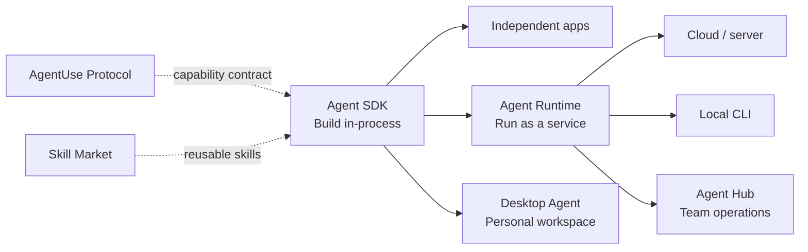

<p align="center">
  <a href="./README.md">English</a> · <a href="./README.zh-CN.md">简体中文</a>
</p>

<h1 align="center">ZERONE AGENTS</h1>

<p align="center"><strong>Build Agents in-process. Run them as services.</strong></p>
<p align="center">From Zero to One, toward the Agent-First era.</p>

<p align="center">
  <a href="https://www.npmjs.com/package/@zerone-agent/agent-sdk"></a>
  <a href="https://www.npmjs.com/package/@zerone-agent/agent-runtime"></a>
  <a href="https://github.com/zerone-agents/agent-sdk/blob/main/LICENSE"></a>
  
</p>

Zerone Agents is open-source developer infrastructure for building complete Agent capabilities inside applications and running those same capabilities as independently deployable services. Around that foundation, Zerone provides products for personal Agent work and team operations.

## How the pieces fit



## Open-source foundation

| Project | What it does | Links |
| --- | --- | --- |
| **Agent SDK** | Runs the complete Agent loop in-process, with model providers, tools, MCP, skills, sessions, hooks, and permissions. | [GitHub](https://github.com/zerone-agents/agent-sdk) · [npm](https://www.npmjs.com/package/@zerone-agent/agent-sdk) · [Overview](https://www.zerone.run/en/sdk-runtime) |
| **Agent Runtime** | Builds on Agent SDK to expose Agents through standard HTTP, SSE, sessions, metrics, authentication, and a multi-Agent registry. | [GitHub](https://github.com/zerone-agents/agent-runtime) · [npm](https://www.npmjs.com/package/@zerone-agent/agent-runtime) · [Overview](https://www.zerone.run/en/sdk-runtime) |

Both projects are open source under the MIT License.

## Quick start

### Build an Agent in-process

```bash
npm install @zerone-agent/agent-sdk
```

```ts
import { createAgent } from "@zerone-agent/agent-sdk";

const agent = createAgent({ model: "claude-sonnet-4-6" });
const result = await agent.prompt("Summarize this project.");

console.log(result.text);
```

See the [Agent SDK documentation](https://github.com/zerone-agents/agent-sdk#readme) for providers, tools, MCP, skills, and permissions.

### Run Agents as a service

```bash
npm install @zerone-agent/agent-runtime
```

Create an `agents.yaml` anywhere you want:

```yaml
agents:
  - id: assistant
    model: claude-sonnet-4-6
    systemPrompt: You are a helpful assistant.
```

Start the runtime with its explicit path:

```bash
npx open-agent --config ./agents.yaml
```

See the [Agent Runtime documentation](https://github.com/zerone-agents/agent-runtime#readme) for HTTP/SSE APIs, sessions, metrics, authentication, and deployment.

## Zerone products

### Desktop Agent

A local-first, extensible, remotely controllable desktop Agent workspace for individual work.

[Explore Desktop Agent](https://www.zerone.run/en/app)

### Agent Hub

Centralize models, tools, skills, and knowledge so a team can configure, run, and govern its Agents consistently.

[Explore Agent Hub](https://www.zerone.run/en/hub)

## Explore the ecosystem

- **[AgentUse Protocol](https://www.zerone.run/en/protocol)** — a standard for exposing software capabilities to Agents in a structured, discoverable, and verifiable way.
- **[Skill Market](https://www.zerone.market/en)** — discover and distribute reusable Agent skills.
- **[Zerone](https://www.zerone.run/en)** — explore the complete product line.

## Contributing and community

We welcome focused issues and pull requests in [Agent SDK](https://github.com/zerone-agents/agent-sdk) and [Agent Runtime](https://github.com/zerone-agents/agent-runtime). For product questions, ideas, and broader discussion, visit [GitHub Discussions](https://github.com/orgs/zerone-agents/discussions).
