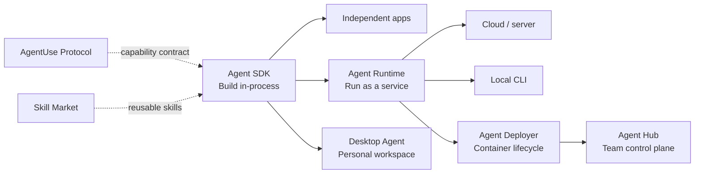

  <a href="./README.md">English</a> · <a href="./README.zh-CN.md">简体中文</a>

<h1 align="center">ZERONE AGENTS</h1>

<strong>Build Agents in-process. Run them as services.</strong>

From Zero to One, toward the Agent-First era.

  
  
  
  

  
  
  
  

Zerone Agents builds developer infrastructure for adding complete Agent capabilities to applications, exposing them as services, managing their container lifecycle, and operating them across teams. Most of the stack is open source under the MIT License; Agent Hub is source-available under its own license.

## How the pieces fit

```mermaid
flowchart LR
  SDK["Agent SDK<br/>Build in-process"] --> APP["Independent apps"]
  SDK --> RT["Agent Runtime<br/>Run as a service"]
  RT --> CLOUD["Cloud / server"]
  RT --> CLI["Local CLI"]
  RT --> DEPLOYER["Agent Deployer<br/>Container lifecycle"]
  DEPLOYER --> HUB["Agent Hub<br/>Team control plane"]
  SDK --> DESKTOP["Desktop Agent<br/>Personal workspace"]
  PROTOCOL["AgentUse Protocol"] -. "capability contract" .-> SDK
  MARKET["Skill Market"] -. "reusable skills" .-> SDK
```

## Public developer stack

| Project | What it does | License | Links |
| --- | --- | --- | --- |
| **Agent SDK** | Runs the complete Agent loop in-process, with model providers, tools, MCP, skills, sessions, hooks, and permissions. | [MIT](https://github.com/zerone-agents/agent-sdk/blob/main/LICENSE) | [GitHub](https://github.com/zerone-agents/agent-sdk) · [npm](https://www.npmjs.com/package/@zerone-agent/agent-sdk) · [Overview](https://www.zerone.run/en/sdk-runtime) |
| **Agent Runtime** | Builds on Agent SDK to expose Agents through standard HTTP, SSE, sessions, metrics, authentication, and a multi-Agent registry. | [MIT](https://github.com/zerone-agents/agent-runtime/blob/main/LICENSE) | [GitHub](https://github.com/zerone-agents/agent-runtime) · [npm](https://www.npmjs.com/package/@zerone-agent/agent-runtime) · [Overview](https://www.zerone.run/en/sdk-runtime) |
| **Agent Deployer** | Manages the lifecycle of Agent Runtime Docker containers, including configuration, sessions, and skills. | [MIT](https://github.com/zerone-agents/agent-deployer/blob/main/LICENSE) | [GitHub](https://github.com/zerone-agents/agent-deployer) |
| **Agent Hub** | Provides the team control plane for configuring, deploying, managing, and governing Agents. | [Source-available](https://github.com/zerone-agents/agent-hub/blob/main/LICENSE) | [GitHub](https://github.com/zerone-agents/agent-hub) · [Overview](https://www.zerone.run/en/hub) |

Agent SDK, Agent Runtime, and Agent Deployer are open source under the MIT License. Agent Hub is source-available under the Zerone Agent Hub License; review its terms for hosted services, commercial embedding, and branding requirements.

## Zerone products

### Desktop Agent

A local-first, extensible, remotely controllable desktop Agent workspace for individual work.

[Explore Desktop Agent](https://www.zerone.run/en/app)

### Agent Hub

Centralize models, tools, skills, and knowledge so a team can configure, run, and govern its Agents consistently.

[Explore Agent Hub](https://www.zerone.run/en/hub) · [View source](https://github.com/zerone-agents/agent-hub)

## Explore the ecosystem

- **[AgentUse Protocol](https://www.zerone.run/en/protocol)** — a standard for exposing software capabilities to Agents in a structured, discoverable, and verifiable way.
- **[Skill Market](https://www.zerone.market/en)** — discover and distribute reusable Agent skills.
- **[Zerone](https://www.zerone.run/en)** — explore the complete product line.

## Contributing and community

We welcome focused issues and pull requests across [Agent SDK](https://github.com/zerone-agents/agent-sdk), [Agent Runtime](https://github.com/zerone-agents/agent-runtime), [Agent Deployer](https://github.com/zerone-agents/agent-deployer), and [Agent Hub](https://github.com/zerone-agents/agent-hub). For product questions, ideas, and broader discussion, visit [GitHub Discussions](https://github.com/orgs/zerone-agents/discussions).
