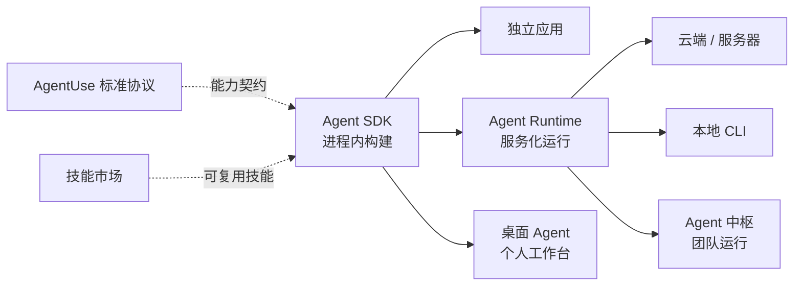

<p align="center">
  <a href="./README.md">English</a> · <a href="./README.zh-CN.md">简体中文</a>
</p>

<h1 align="center">ZERONE AGENTS</h1>

<p align="center"><strong>在进程内构建 Agent，把 Agent 作为服务运行。</strong></p>
<p align="center">从零（Zero）到一（One），通往 Agent-First 时代。</p>

<p align="center">
  <a href="https://www.npmjs.com/package/@zerone-agent/agent-sdk"></a>
  <a href="https://www.npmjs.com/package/@zerone-agent/agent-runtime"></a>
  <a href="https://github.com/zerone-agents/agent-sdk/blob/main/LICENSE"></a>
  
</p>

Zerone Agents 是面向开发者的开源基础设施：既能在应用进程内构建完整的 Agent 能力，也能把同一套能力作为可独立部署的服务运行。在这套基础设施之上，Zerone 还提供面向个人 Agent 工作和团队运行的产品。

## 产品关系



## 开源基础设施

| 项目 | 作用 | 链接 |
| --- | --- | --- |
| **Agent SDK** | 在进程内运行完整的 Agent loop，提供模型、工具、MCP、技能、会话、Hooks 与权限能力。 | [GitHub](https://github.com/zerone-agents/agent-sdk) · [npm](https://www.npmjs.com/package/@zerone-agent/agent-sdk) · [产品介绍](https://www.zerone.run/zh/sdk-runtime) |
| **Agent Runtime** | 在 Agent SDK 之上，通过标准 HTTP、SSE、会话、指标、认证与多 Agent 注册能力对外提供服务。 | [GitHub](https://github.com/zerone-agents/agent-runtime) · [npm](https://www.npmjs.com/package/@zerone-agent/agent-runtime) · [产品介绍](https://www.zerone.run/zh/sdk-runtime) |

两款产品均以 MIT License 开源。

## 快速开始

### 在进程内构建 Agent

```bash
npm install @zerone-agent/agent-sdk
```

```ts
import { createAgent } from "@zerone-agent/agent-sdk";

const agent = createAgent({ model: "claude-sonnet-4-6" });
const result = await agent.prompt("总结这个项目。");

console.log(result.text);
```

模型、工具、MCP、技能与权限等完整用法请查看 [Agent SDK 文档](https://github.com/zerone-agents/agent-sdk#readme)。

### 把 Agent 作为服务运行

```bash
npm install @zerone-agent/agent-runtime
```

在任意位置创建 `agents.yaml`：

```yaml
agents:
  - id: assistant
    model: claude-sonnet-4-6
    systemPrompt: 你是一位乐于助人的助手。
```

通过明确路径启动 Runtime：

```bash
npx open-agent --config ./agents.yaml
```

HTTP/SSE 接口、会话、指标、认证与部署方式请查看 [Agent Runtime 文档](https://github.com/zerone-agents/agent-runtime#readme)。

## Zerone 产品

### 桌面 Agent

本地优先、可扩展、可远程控制的桌面 Agent 工作台，服务于个人工作场景。

[了解桌面 Agent](https://www.zerone.run/zh/app)

### Agent 中枢

集中配置模型、工具、技能与知识，让团队的 Agent 得以统一配置、运行与治理。

[了解 Agent 中枢](https://www.zerone.run/zh/hub)

## 探索生态

- **[AgentUse 标准协议](https://www.zerone.run/zh/protocol)** — 让软件能力以结构化、可发现、可验证的方式暴露给 Agent。
- **[技能市场](https://www.zerone.market/zh)** — 发现与分发可复用的 Agent 技能。
- **[Zerone 官网](https://www.zerone.run/zh)** — 了解完整产品线。

## 参与贡献与交流

欢迎在 [Agent SDK](https://github.com/zerone-agents/agent-sdk) 和 [Agent Runtime](https://github.com/zerone-agents/agent-runtime) 提交明确的问题与 Pull Request。产品问题、想法与更多讨论请前往 [GitHub Discussions](https://github.com/orgs/zerone-agents/discussions)。
