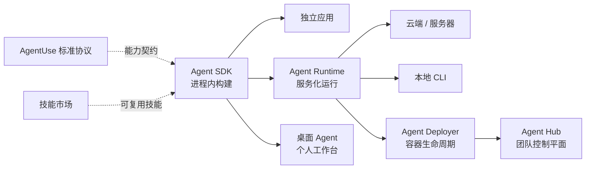

  <a href="./README.md">English</a> · <a href="./README.zh-CN.md">简体中文</a>

<h1 align="center">ZERONE AGENTS</h1>

<strong>在进程内构建 Agent，把 Agent 作为服务运行。</strong>

从零（Zero）到一（One），通往 Agent-First 时代。

  
  
  
  

  
  
  
  

Zerone Agents 构建面向开发者的 Agent 基础设施：在应用进程内构建完整能力，将其作为服务对外运行，管理运行时容器的生命周期，并支持团队统一运行与治理。其中大部分组件以 MIT License 开源；Agent Hub 则以自有许可证开放源代码。

## 产品关系

```mermaid
flowchart LR
  SDK["Agent SDK<br/>进程内构建"] --> APP["独立应用"]
  SDK --> RT["Agent Runtime<br/>服务化运行"]
  RT --> CLOUD["云端 / 服务器"]
  RT --> CLI["本地 CLI"]
  RT --> DEPLOYER["Agent Deployer<br/>容器生命周期"]
  DEPLOYER --> HUB["Agent Hub<br/>团队控制平面"]
  SDK --> DESKTOP["桌面 Agent<br/>个人工作台"]
  PROTOCOL["AgentUse 标准协议"] -. "能力契约" .-> SDK
  MARKET["技能市场"] -. "可复用技能" .-> SDK
```

## 公开开发栈

| 项目 | 作用 | 许可证 | 链接 |
| --- | --- | --- | --- |
| **Agent SDK** | 在进程内运行完整的 Agent loop，提供模型、工具、MCP、技能、会话、Hooks 与权限能力。 | [MIT](https://github.com/zerone-agents/agent-sdk/blob/main/LICENSE) | [GitHub](https://github.com/zerone-agents/agent-sdk) · [npm](https://www.npmjs.com/package/@zerone-agent/agent-sdk) · [产品介绍](https://www.zerone.run/zh/sdk-runtime) |
| **Agent Runtime** | 在 Agent SDK 之上，通过标准 HTTP、SSE、会话、指标、认证与多 Agent 注册能力对外提供服务。 | [MIT](https://github.com/zerone-agents/agent-runtime/blob/main/LICENSE) | [GitHub](https://github.com/zerone-agents/agent-runtime) · [npm](https://www.npmjs.com/package/@zerone-agent/agent-runtime) · [产品介绍](https://www.zerone.run/zh/sdk-runtime) |
| **Agent Deployer** | 管理 Agent Runtime Docker 容器的生命周期，包括配置、会话与技能。 | [MIT](https://github.com/zerone-agents/agent-deployer/blob/main/LICENSE) | [GitHub](https://github.com/zerone-agents/agent-deployer) |
| **Agent Hub** | 提供团队控制平面，用于统一配置、部署、管理与治理 Agent。 | [源码可用](https://github.com/zerone-agents/agent-hub/blob/main/LICENSE) | [GitHub](https://github.com/zerone-agents/agent-hub) · [产品介绍](https://www.zerone.run/zh/hub) |

Agent SDK、Agent Runtime 与 Agent Deployer 均以 MIT License 开源。Agent Hub 基于 Zerone Agent Hub License 开放源代码；托管服务、商业嵌入与品牌使用等请以许可证原文为准。

## Zerone 产品

### 桌面 Agent

本地优先、可扩展、可远程控制的桌面 Agent 工作台，服务于个人工作场景。

[了解桌面 Agent](https://www.zerone.run/zh/app)

### Agent 中枢

集中配置模型、工具、技能与知识，让团队的 Agent 得以统一配置、运行与治理。

[了解 Agent 中枢](https://www.zerone.run/zh/hub) · [查看源代码](https://github.com/zerone-agents/agent-hub)

## 探索生态

- **[AgentUse 标准协议](https://www.zerone.run/zh/protocol)** — 让软件能力以结构化、可发现、可验证的方式暴露给 Agent。
- **[技能市场](https://www.zerone.market/zh)** — 发现与分发可复用的 Agent 技能。
- **[Zerone 官网](https://www.zerone.run/zh)** — 了解完整产品线。

## 参与贡献与交流

欢迎在 [Agent SDK](https://github.com/zerone-agents/agent-sdk)、[Agent Runtime](https://github.com/zerone-agents/agent-runtime)、[Agent Deployer](https://github.com/zerone-agents/agent-deployer) 与 [Agent Hub](https://github.com/zerone-agents/agent-hub) 提交明确的问题与 Pull Request。产品问题、想法与更多讨论请前往 [GitHub Discussions](https://github.com/orgs/zerone-agents/discussions)。
